# Zephyr RTOS 使用MQTT over (TCP/TLS)  连接到EMQX MQTT Broker

## 一、 引言与背景简介

### 1.1 项目简介与系统架构

本文演示如何让运行在 [Zephyr RTOS](https://www.zephyrproject.org/) 上的嵌入式设备通过 MQTT 协议连接到 [EMQX](https://www.emqx.com/zh/products/emqx) 消息服务器，并逐步从明文 TCP 连接升级到 TLS 双向认证（mTLS）的安全通信。所有代码在 `native_sim/native/64` 模拟平台上验证通过，您无需真实硬件即可在 Linux 容器中复现全部流程。

本示例项目提供**两套可选运行模式**，您可按需选择：

| 模式 | 网络模型 | 安全能力 | 适合场景 |
|------|----------|----------|----------|
| **NSOS / TCP-only** | native_sim offloaded sockets（复用宿主机网络栈） | 明文 MQTT，不支持 Zephyr socket TLS | 快速连通性验证、非加密内网设备 |
| **TAP + TLS** | Zephyr 独立网络栈（虚拟网卡 `zeth`） | TLS 1.2 加密 + 双向 mTLS 认证 | 安全需求场景、证书身份认证 |

> **模式选择建议**：若只想快速体验 MQTT 发布/订阅，选 NSOS/TCP-only（无需 sudo、无需证书）。若需评估 TLS/mTLS 在 Zephyr 上的可行性，选 TAP+TLS（需 Linux 宿主机、容器 `NET_ADMIN` 权限及 `/dev/net/tun`）。

系统架构如下：

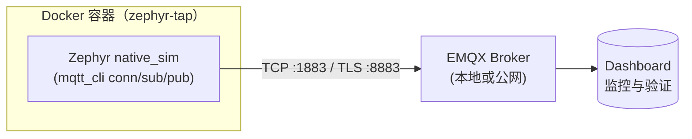

### 1.2 EMQX 简介：现代物联网的云原生 MQTT 消息服务器

[EMQX](https://www.emqx.com/zh/products/emqx) 是一款大规模分布式物联网接入平台，单节点可稳定支持 **150 万** MQTT 设备并发连接，集群可水平扩展至 **1 亿** 并发，消息吞吐达每秒百万级且延迟低至毫秒级。当前最新版本为 **EMQX 6.1.1 企业版**，完整支持 MQTT 3.1/3.1.1/5.0 协议。


*EMQX 平台架构概览（来源：[EMQX 官方文档](https://docs.emqx.com/zh/emqx/latest/)）*

**协议与接入能力**：

- **MQTT over QUIC**：业界首创在 MQTT 协议中引入 QUIC 传输层，在弱网、链路频繁变化的场景（如车联网）下显著提升连接稳定性和消息吞吐。
- **多协议网关**：除 MQTT 外，原生支持 HTTP、WebSocket、LwM2M/CoAP 等多种协议接入，统一设备连接入口。
- **消息队列**（EMQX 6.x）：支持命名持久化队列，发布与订阅解耦，消费者离线时消息自动缓存，上线后可回放——非常适合 Zephyr 端侧设备间歇性断连的 IoT 场景。
- **MQTT 消息流**（EMQX 6.x）：可持久化、可回放的消息流模型，支持按时间戳或 Offset 回放历史消息，无需引入 Kafka 等外部流系统。

**安全与认证**：

- 端到端 TLS/SSL 加密，支持 TLS 1.2/1.3
- 多种客户端认证机制：X.509 证书、用户名/密码、JWT、PSK、增强认证（SCRAM）
- 基于 ACL 的细粒度发布/订阅授权，认证数据可对接 LDAP、HTTP、SQL/NoSQL 等外部系统
- 托管证书管理（EMQX 6.1+）：证书作为可复用资源集中管理，支持 Dashboard/REST API 上下传，更新后自动重载无需重启

**数据集成与处理**：

- **内置规则引擎**：基于 SQL 语法实时提取、过滤、转换 MQTT 消息
- **Flow 设计器**：可视化编排消息处理流程，支持调用 LLM（OpenAI、Google Gemini、Anthropic Claude）对消息内容进行 AI 处理
- **40+ 数据桥接**：开箱即用集成 Kafka、PostgreSQL、TimescaleDB、InfluxDB、MongoDB、AWS S3、Google BigQuery 等主流系统

**运维与可观测性**：

- **图形化 Dashboard**：实时监控客户端连接、消息吞吐、Topic 统计、集群健康状态
- 支持 Prometheus、Datadog、OpenTelemetry 指标导出
- 多租户命名空间角色：不同团队/客户资源隔离，适合大规模 SaaS 化部署

**部署方式**：Docker、Kubernetes（Operator + Terraform）、裸机/虚拟机，均可快速部署。

本文使用的 EMQX 可通过 Docker 一键启动，详见 [2.1 节](#21-emqx-broker-的安装与快速部署docker原生)。

### 1.3 Zephyr RTOS 简介：面向嵌入式物联网的高性能实时操作系统

[Zephyr RTOS](https://www.zephyrproject.org/) 是 Linux 基金会旗下的开源实时操作系统，采用 Apache 2.0 许可证，专为资源受限的嵌入式系统设计——从简单的环境传感器、LED 可穿戴设备，到复杂的嵌入式控制器、智能手表和 IoT 无线应用均可胜任。

**广泛的硬件支持**：

Zephyr 支持十余种 CPU 架构，包括 ARM Cortex-M/A/R、RISC-V（32/64 位）、x86（32/64 位）、ARC、MIPS、Xtensa、SPARC 等，已适配 [数百款开发板](https://docs.zephyrproject.org/latest/boards/index.html)。本文使用 `native_sim` 平台在 x86 上模拟运行，无需真实硬件即可完成全部开发调试。

**可扩展的内核服务**：

- **多线程调度**：支持协作式、抢占式、EDF（最早截止优先）等多种调度算法，可选时间片轮转和 POSIX pthreads 兼容 API
- **线程间通信**：二进制/计数/互斥信号量、消息队列、增强消息队列、字节流
- **内存管理**：固定/可变大小内存块动态分配；有 MMU/MPU 的平台支持线程级隔离和用户空间，资源受限平台支持单地址空间的自定义内核镜像
- **电源管理**：系统级和应用级电源管理，驱动级细粒度设备电源管理

**原生网络协议栈**：

Zephyr 内置完整的网络协议栈，支持 LwM2M、BSD socket、TCP/UDP/IPv4/IPv6、DNS、TLS/mbedTLS、HTTP、MQTT、CoAP 等协议，并可选 OpenThread 网状网络支持。网络栈高度可裁剪，仅编译应用实际需要的协议模块。

**安全与可靠性**：

- 可配置的架构级栈溢出保护
- 内核对象和驱动权限跟踪
- 线程级内存隔离（x86/ARC/ARM）
- 完整的安全漏洞报告与 CVE 追踪机制

**模块化与编译时配置**：

应用通过 Kconfig 仅引入所需功能并指定数量和大小。硬件通过 [Devicetree](https://docs.zephyrproject.org/latest/build/dts/index.html) 描述，编译时完成系统资源的静态分配，显著减小代码体积并提升性能。

**丰富的 OS 服务**：

- **Bluetooth 5.0 Low Energy**：完整 BLE Host + Controller 支持，含 Bluetooth Mesh（中继、Friend、LPN、GATT 代理）
- **虚拟文件系统**：支持 ext2、FatFS、LittleFS 及闪存循环缓冲（FCB）
- **持久化存储**：NVS（非易失存储）和 Settings 子系统，以键值对形式保存配置与运行时状态
- **多后端日志系统**：支持内存、网络、文件、控制台等多种输出，与 Shell 深度集成
- **全功能 Shell**：支持自动补全、通配符、着色、方向键和历史记录

**native_sim 模拟平台**：

可直接将 Zephyr 编译为 Linux 原生可执行文件，支持网络、文件系统、蓝牙等子系统的仿真，极大加速开发与测试迭代——这也是本文所用 `native_sim/native/64` 平台的核心能力。

本项目的关键 Zephyr 组件：

| 组件 | 用途 |
|------|------|
| `CONFIG_MQTT_LIB` | Zephyr 原生 MQTT 3.1.1 客户端库 |
| `CONFIG_MQTT_LIB_TLS` | 启用 MQTT over TLS 传输层 |
| mbedTLS | 嵌入式 TLS 库，支持 PEM 证书解析、ECDHE-RSA 密钥交换 |
| `native_sim` 平台 | x86 模拟环境，无需真实硬件即可开发调试 |
| Shell / getopt | 交互式命令行，支持 GNU 风格参数解析与自动补全 |


## 二、 环境准备

### 2.1 EMQX Broker 的安装与快速部署

EMQX 支持多种安装方式，包括 Docker 容器化部署、Kubernetes Operator、EMQX Cloud 全托管云服务、以及各主流 Linux 发行版的安装包部署。本节按推荐顺序介绍四种方式，您可按需选择。

**方式一：Docker 容器化部署（推荐）**

容器化部署是体验 EMQX 的最快方式，也是官方快速开始指南的首选方案。运行前请确保 [Docker](https://www.docker.com/) 已安装且已启动。

```bash
# 下载并启动最新版 EMQX 企业版
docker run -d --name emqx \
  -p 1883:1883 \
  -p 8083:8083 \
  -p 8084:8084 \
  -p 8883:8883 \
  -p 18083:18083 \
  emqx/emqx-enterprise:latest
```

启动后通过浏览器访问 `http://localhost:18083`（`localhost` 可替换为实际 IP），使用默认用户名 `admin`、密码 `public` 登录 Dashboard。

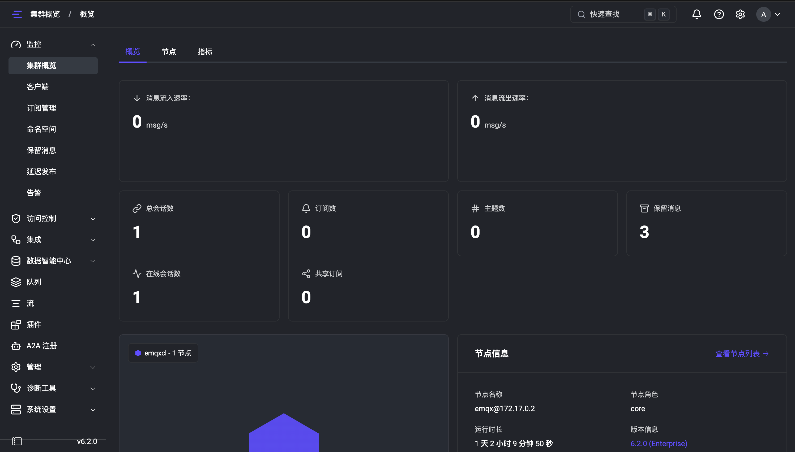

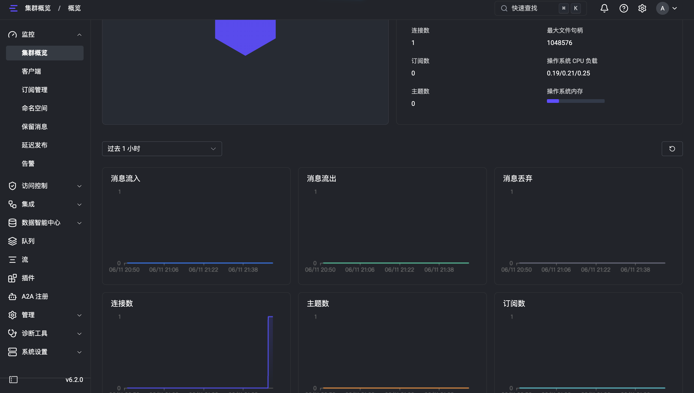

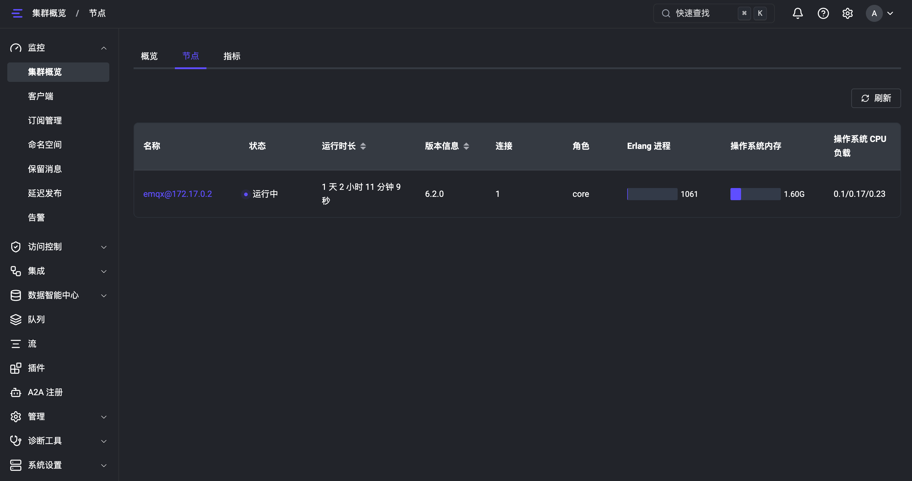

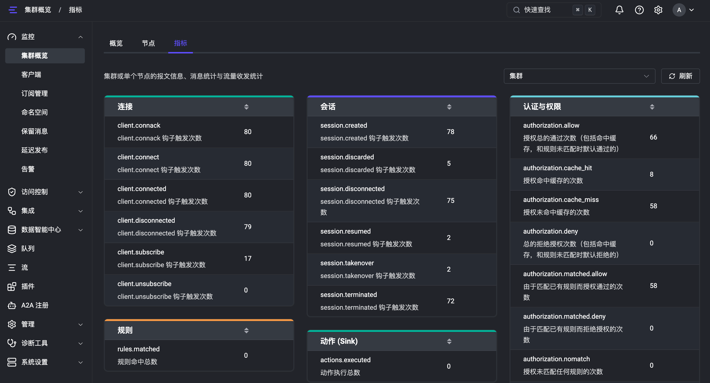

*EMQX Dashboard 首页概览面板，显示运行状态与基本指标。*

**使用 MQTTX 快速验证**（可选）：

[MQTTX](https://mqttx.app/zh) 是 EMQ 官方开源的跨平台 MQTT 5.0 客户端工具，支持 Web 版（无需安装）和桌面版。访问 [MQTTX Web](http://mqttx.app/web-client)，新建连接填 `ws://localhost:8083`，即可快速订阅/发布消息并验证 Broker 连通性。

**方式二：安装包部署（macOS / Linux）**

如需在物理机或虚拟机上直接部署以便后续调优，可使用 EMQX 提供的操作系统安装包。支持的平台包括 RedHat、CentOS、RockyLinux、Ubuntu、Debian、macOS 等。

以 macOS 为例：

```bash
# 1. 从官网下载页面获取最新版本安装包
#    https://www.emqx.com/zh/downloads-and-install/enterprise?os=macOS

# 2. 解压后启动（前台运行，方便观察日志）
./emqx/bin/emqx foreground

# 3. 访问 Dashboard：http://localhost:18083（admin / public）

# 4. 停止 EMQX
./emqx/bin/emqx stop
```

其他 Linux 发行版的安装命令可参考 [EMQX 官方安装指南](https://docs.emqx.com/zh/emqx/latest/deploy/install.html)。

**方式三：EMQX Cloud 全托管云服务**

除了私有部署外，EMQX 还提供全托管的 [EMQX Cloud](https://docs.emqx.com/zh/cloud/latest/quick_start/introduction.html) 云服务。您只需几步注册即可获得一个完全托管、免运维的 MQTT 消息服务器，无需自行安装和管理基础设施，适合快速上线或规模化生产部署。

> 前往 [EMQX Cloud 注册](https://accounts-zh.emqx.com/signup?continue=https%3A%2F%2Fcloud.emqx.com%2Fconsole%2Fdeployments%2Fnew) 页面即可免费试用。详细入门指引见 [EMQX Cloud 快速开始](https://docs.emqx.com/zh/cloud/latest/quick_start/introduction.html)。

**方式四：公网测试服务器（快速体验备选）**

若暂时不便安装 Docker 或本地部署，EMQX 提供免费公网 Broker 用作快速连通性测试：

| 端口 | 协议 | 地址 |
|------|------|------|
| 1883 | MQTT TCP | `broker.emqx.io` |
| 8883 | MQTT TLS | `broker.emqx.io` |

```bash
# 在容器内快速验证连通性
mqtt_cli conn -h broker.emqx.io -p 1883
```

> **注意**：公网测试服务器为共享环境，不保证稳定性和消息隐私，仅适合快速体验，不应用于正式开发或生产。

### 2.2 基于 Docker 的 Zephyr RTOS 开发环境搭建与 West 工具链准备

**环境要求**：Linux 宿主机（内核 ≥ 5.x），Docker 已安装且运行，TUN 模块已加载。

**第一步：检查 TUN 模块**

```bash
lsmod | grep tun
# 如果没有，加载：
sudo modprobe tun
```

**第二步：拉取官方镜像并创建容器**

Zephyr 官方开发镜像 `ghcr.io/zephyrproject-rtos/zephyr-build` 已预装 west、CMake、Python venv、Zephyr SDK、GCC 工具链，免去手动安装 SDK 和 Python 依赖的繁琐步骤。

```bash
# 拉取 Zephyr 官方开发镜像
docker pull ghcr.io/zephyrproject-rtos/zephyr-build:main

# 创建容器（--cap-add=NET_ADMIN 和 --device=/dev/net/tun 是 TAP 必需的）
docker run -d \
    --name zephyr-tap \
    --cap-add=NET_ADMIN \
    --device=/dev/net/tun \
    -p 2222:22 \
    -v ~/Projects/EMQ/ZephyrProject:/workdir \
    ghcr.io/zephyrproject-rtos/zephyr-build:main \
    sleep infinity

# 进入容器
docker exec -it zephyr-tap bash
```

**第三步：初始化 Zephyr 工作区**

```bash
# 创建工作区
mkdir -p /workdir && cd /workdir

# 初始化 Zephyr 仓库
west init -m https://github.com/zephyrproject-rtos/zephyr --mr v4.1-branch
west update

# 导出 Zephyr CMake 包
west zephyr-export

# 激活 Python 虚拟环境
source /var/lib/zephyr/venv/bin/activate
echo 'source /var/lib/zephyr/venv/bin/activate' >> ~/.bashrc
```

**第四步：安装 iptables（TAP 模式网络转发需要）**

```bash
apt-get update && apt-get install -y --no-install-recommends \
    iptables \
    && rm -rf /var/lib/apt/lists/*
```

> **macOS / Docker Desktop 用户注意**：TAP 模式在 macOS Docker Desktop 上受限，建议使用 NSOS/TCP-only 模式或切换到 Linux 宿主机/WSL2。


## 三、 Zephyr MQTT 示例 Demo 解析

### 3.1 MQTT Demo 工程结构与核心逻辑解析

本仓库的工程结构如下。核心逻辑集中在 `src/main.c`（约 650 行），其余为模式配置和启动脚本：

```
mqtt-client-C-Zephyr/
├── src/main.c                  # MQTT 客户端主逻辑
├── prj.conf                    # 共享基础 Kconfig（网络/DNS/Shell/MQTT）
├── prj-nsos.conf               # NSOS/TCP-only 模式 overlay
├── prj-tap-tls.conf            # TAP+TLS 模式 overlay
├── run-zephyr-nsos.sh          # NSOS 模式一键启动
├── run-zephyr-tap.sh           # TAP 模式一键启动（含网络配置）

```

`src/main.c` 的核心执行流程如下：

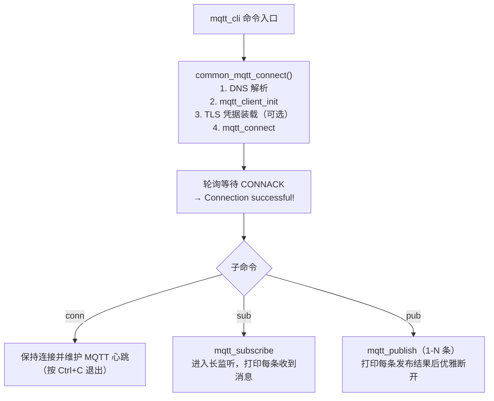

### 3.2 Demo 命令行参数与 Kconfig 核心选项介绍

`mqtt_cli` 提供三个子命令，统一共享以下连接参数和 TLS 选项：

**连接参数（全部子命令通用）**

| 参数 | 说明 | 默认值 |
|------|------|--------|
| `-h, --host` | Broker 地址 | `100.108.113.19` |
| `-p, --port` | Broker 端口 | `1883` |
| `-i, --client_id` | MQTT Client ID | 随机生成 |
| `-k, --keepalive` | 心跳间隔（秒） | `60` |
| `--no_clean` | 禁用 Clean Session | `false` |
| `-u, --username` | 用户名认证 | — |
| `-P, --password` | 密码认证 | — |


**TLS 参数（仅 TAP+TLS 模式，`CONFIG_MQTT_LIB_TLS=y` 时可用）**

| 参数 | 说明 |
|------|------|
| `--ca <PATH>` | 根 CA 证书文件路径 |
| `--cert <PATH>` | 客户端证书 |
| `--key <PATH>` | 客户端私钥 |
| `--insecure` | 跳过服务端证书验证 |
| `--key_password <PASS>` | 私钥密码（若加密） |


**三个子命令及特有参数**

| 命令 | 用途 | 特有参数 |
|------|------|----------|
| `mqtt_cli conn` | 测试连接 | 无 |
| `mqtt_cli sub` | 订阅并长监听 | `-t <TOPIC>` `-q <QOS>` |
| `mqtt_cli pub` | 发布后退出 | `-t <TOPIC>` `-m <MSG>` `-q <QOS>` `-L <条数>` `-I <间隔ms>` `-r`(保留) `-d`(重发) |

**Kconfig 配置的两层结构**

所有模式共用 `prj.conf` 中的基础配置（网络栈、IPv4、TCP、DNS、MQTT、Shell 等），模式差异通过 **overlay 文件** 注入：

- **NSOS/TCP-only** → `prj-nsos.conf`：启用 `CONFIG_NET_SOCKETS_OFFLOAD=y`、`CONFIG_NET_NATIVE_OFFLOADED_SOCKETS=y`。Zephyr socket 调用直接转发给宿主机 POSIX socket。**不支持 TLS**，因为 offloaded socket 上不存在 `SO_TLS` setsockopt。
- **TAP+TLS** → `prj-tap-tls.conf`：启用完整 mbedTLS 栈（heap 30KB、ECDHE-RSA-AES-128-GCM 密码套件、PEM 解析、PSA 密钥类型）。Zephyr 拥有独立 IP `192.0.2.1`，通过 `zeth` 虚拟网卡经宿主机 NAT 访问外网。

### 3.3 核心代码解析

本节选取 `src/main.c` 中最关键的三个代码块进行解读：事件回调、连接引擎、TLS 凭据装载。

**代码块一：MQTT 事件回调**

```c
void mqtt_evt_handler(struct mqtt_client *client, const struct mqtt_evt *evt)
{
    switch (evt->type) {
    case MQTT_EVT_CONNACK:
        if (evt->result == 0) {
            is_connected = true;                   // ① 连接成功标志
        } else {
            LOG_ERR("MQTT connection refused: %d", evt->result);
        }
        break;
    case MQTT_EVT_DISCONNECT:
        is_connected = false;
        break;
    case MQTT_EVT_PUBLISH: {
        const struct mqtt_publish_param *pub = &evt->param.publish;

        // ② QoS 1/2 自动回复确认，避免 broker 重传
        if (pub->message.topic.qos == MQTT_QOS_1_AT_LEAST_ONCE) {
            const struct mqtt_puback_param ack = { .message_id = pub->message_id };
            mqtt_publish_qos1_ack(client, &ack);
        } else if (pub->message.topic.qos == MQTT_QOS_2_EXACTLY_ONCE) {
            const struct mqtt_pubrec_param rec = { .message_id = pub->message_id };
            mqtt_publish_qos2_receive(client, &rec);
        }

        uint8_t payload_buf[128];
        int len = MIN(pub->message.payload.len, sizeof(payload_buf) - 1);
        int rc = mqtt_read_publish_payload(client, payload_buf, len);
        if (rc >= 0) {
            payload_buf[rc] = '\0';
            // ③ 通过全局 shell 指针使用 shell_print 输出
            //    native_sim 上 LOG_INF 会因双通道输出导致重复
            shell_print(mqtt_evt_shell,
                "[Received Msg] Topic: %.*s | Payload: %s",
                pub->message.topic.topic.size,
                pub->message.topic.topic.utf8, payload_buf);
        }
        break;
    }
    }
}
```

> **解读**：① Zephyr MQTT 库收到 `CONNACK` 且 `result==0` 时表示 Broker 接受连接，将全局标志 `is_connected` 置为 `true`。② 对于 QoS 1/2 消息，必须显式调用 `mqtt_publish_qos1_ack()` / `mqtt_publish_qos2_receive()` 回复确认，否则 broker 会不断重传（参考 Zephyr 官方 `secure_mqtt_sensor_actuator` sample）。③ 收到消息后通过全局 shell 指针 `mqtt_evt_shell` 使用 `shell_print` 输出。native_sim 平台上 `LOG_INF` 和 `printk` 会因 UART native PTY 与 log backend 双通道同时输出到 stdout 导致每条日志打印两次；`shell_print` 仅走 UART 单通道，输出不重复。

**代码块二：通用连接引擎 `common_mqtt_connect()`**

```c
static int common_mqtt_connect(const struct shell *sh, struct mqtt_conn_params *p)
{
    is_connected = false;

    mqtt_evt_shell = sh;  // 记录 shell 指针供事件回调使用

    // ① DNS 解析：主机名 → IP 地址
    struct zsock_addrinfo hints = { .ai_family = AF_INET, .ai_socktype = SOCK_STREAM };
    struct zsock_addrinfo *res = NULL;
    char port_str[6];
    snprintf(port_str, sizeof(port_str), "%d", p->port);
    int rc = zsock_getaddrinfo(p->host, port_str, &hints, &res);
    if (rc != 0) { /* error */ return rc; }
    memcpy(&broker_addr, res->ai_addr, res->ai_addrlen);
    zsock_freeaddrinfo(res);

    // ② 初始化 MQTT 客户端结构体
    mqtt_client_init(&client_ctx);
    client_ctx.broker = &broker_addr;
    client_ctx.evt_cb = mqtt_evt_handler;
    client_ctx.client_id.utf8 = (uint8_t *)client_id_global;
    client_ctx.client_id.size = strlen(client_id_global);
    client_ctx.protocol_version = MQTT_VERSION_3_1_1;
    client_ctx.rx_buf = rx_buffer;
    client_ctx.rx_buf_size = sizeof(rx_buffer);
    client_ctx.tx_buf = tx_buffer;
    client_ctx.tx_buf_size = sizeof(tx_buffer);
    client_ctx.keepalive = p->keepalive;

    // ③ TLS 凭据装载（仅 TLS 模式，见代码块三）
    if (p->use_tls) {
#ifdef CONFIG_MQTT_LIB_TLS
        /* ... TLS credential loading and transport config ... */
        client_ctx.transport.type = MQTT_TRANSPORT_SECURE;
#else
        shell_error(sh, "Error: TLS options provided but TLS support is disabled");
        return -ENOTSUP;
#endif
    } else {
        client_ctx.transport.type = MQTT_TRANSPORT_NON_SECURE;
    }

    // ④ 发起 MQTT CONNECT
    rc = mqtt_connect(&client_ctx);
    if (rc != 0) { /* error */ return rc; }

    // ⑤ 轮询等待 CONNACK（超时 5 秒）
    uint32_t timeout = 0;
    while (!is_connected && timeout < 5000) {
        struct zsock_pollfd fds[1] = {
            { .fd = get_client_fd(&client_ctx), .events = ZSOCK_POLLIN }
        };
        if (zsock_poll(fds, 1, 100) > 0) {
            mqtt_input(&client_ctx);  // 驱动事件回调
        }
        k_msleep(100);
        timeout += 100;
    }
    if (!is_connected) { /* timeout error */ return -ETIMEDOUT; }

    shell_print(sh, "Connection successful!");
    return 0;
}
```

> **解读**：`common_mqtt_connect()` 是 `conn`、`sub`、`pub` 三个子命令的公共入口。① 调用 `zsock_getaddrinfo()` 解析 DNS（NSOS 模式下直接走宿主机 glibc，TAP 模式下使用 Zephyr 内置 DNS 栈查询 `8.8.8.8`）；② 填充 `mqtt_client` 结构体，绑定缓冲区、事件回调、Client ID 和 MQTT 协议版本；③ 按需装载 TLS 凭据；④ 调用 `mqtt_connect()` 发送 MQTT CONNECT 报文；⑤ 以 100ms 为间隔轮询 socket，收到 `MQTT_EVT_CONNACK` 后 `is_connected` 被事件回调置 `true`，循环退出，打印成功。

**代码块三：TLS 凭据装载与生命周期管理**

```c
// 每次连接前先清理旧凭据（避免 sec_tag 跨连接残留）
static void clear_registered_credential(enum tls_credential_type type)
{
    tls_credential_delete(101, type);       // ① 从 Zephyr 凭据缓存删除
    struct credential_slot *slot = credential_slot_for_type(type);
    if (slot && slot->buf) {
        free(slot->buf);                    // ② 释放旧缓冲
        slot->buf = NULL;
    }
}

static int load_and_register_credential(const struct shell *sh,
                                         const char *path,
                                         enum tls_credential_type type)
{
    // ③ 为每类凭据 malloc 独立缓冲（不能共用 static buffer）
    uint8_t *file_buf = malloc(3073);  // 3072 + 1 null terminator
    size_t br = fread(file_buf, 1, 3072, f);
    fclose(f);
    file_buf[br] = '\0';               // ④ NUL 终止（crt_is_pem() 要求）

    clear_registered_credential(type); // ⑤ 先清再装
    int rc = tls_credential_add(101, type, file_buf, br + 1);
    // ...
    slot->buf = file_buf;              // ⑥ 记录指针，供下次 free 使用
    return 0;
}

// 在 common_mqtt_connect() 中的调用顺序
clear_registered_credential(TLS_CREDENTIAL_CA_CERTIFICATE);
clear_registered_credential(TLS_CREDENTIAL_PUBLIC_CERTIFICATE);
clear_registered_credential(TLS_CREDENTIAL_PRIVATE_KEY);
load_and_register_credential(sh, p->ca_path,   TLS_CREDENTIAL_CA_CERTIFICATE);
load_and_register_credential(sh, p->cert_path, TLS_CREDENTIAL_PUBLIC_CERTIFICATE);
load_and_register_credential(sh, p->key_path,  TLS_CREDENTIAL_PRIVATE_KEY);

client_ctx.transport.tls.config.sec_tag_list = sec_tag_list;  // {101}
client_ctx.transport.tls.config.peer_verify = p->insecure
    ? TLS_PEER_VERIFY_NONE : TLS_PEER_VERIFY_REQUIRED;
client_ctx.transport.tls.config.hostname = p->host;
```

> **解读**：Zephyr 的 `tls_credential_add()` 要求传入的缓冲区在凭据生命周期内保持有效，因此不能使用栈上或 static 缓冲（后续调用会覆盖前一次内容）。本实现为 CA、Cert、Key 三类凭据各 `malloc` 独立缓冲，并在下次连接前通过 `tls_credential_delete()` + `free()` 清理。这是一个在实践中经过调试验证的关键模式——若不清除旧凭据，跨连接的证书残留会导致 mTLS 握手失败（`-0x4e` / `-103`）。


## 四、 实战演练（一）：Zephyr 客户端通过 TCP 直连 EMQX

本章使用 **NSOS/TCP-only 模式**，无需 sudo 权限、无需证书，构建和启动最简单。

### 4.1 最小化工程配置

**构建命令**（在容器内执行）：

```bash
cd /workdir/mqtt-client-C-Zephyr

# NSOS 模式编译
west build -d build-nsos -p always -b native_sim/native/64 . \
    -- -DOVERLAY_CONFIG=prj-nsos.conf
```


*`west build` 成功输出末尾：`[211/211] Running utility command for native_runner_executable`。*

Zephyr 构建系统会自动合并 `prj.conf`（共享基础）和 `prj-nsos.conf`（NSOS overlay）。关键 Kconfig 项：

```ini
# prj-nsos.conf — 三行搞定 NSOS 联网
CONFIG_NET_DRIVERS=y
CONFIG_NET_SOCKETS_OFFLOAD=y
CONFIG_NET_NATIVE_OFFLOADED_SOCKETS=y
# CONFIG_ETH_NATIVE_TAP is not set

# prj.conf 中共享的网络/DNS/MQTT 基础项保持不变
CONFIG_NETWORKING=y
CONFIG_NET_IPV4=y
CONFIG_NET_TCP=y
CONFIG_NET_SOCKETS=y
CONFIG_DNS_SERVER1="8.8.8.8"
CONFIG_MQTT_LIB=y
```

### 4.2 启动与连接验证

```bash
# 启动 Zephyr（交互式 shell）
./run-zephyr-nsos.sh

# 出现 uart:~$ 提示符后，测试连接
uart:~$ mqtt_cli conn -h 100.108.113.19 -p 1883
```

**预期输出**：

```
Connecting to 100.108.113.19:1883 (ID: zephyr-emqx-123456, Keepalive: 60) ...
[TLS] Calling mqtt_connect (transport.type=0)...
Connection successful!
Entered conn blocking maintenance mode. Press Ctrl+C to terminate simulation process.
```
**运行结果**：
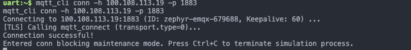

*Zephyr shell 中 `mqtt_cli conn` 成功后打印 `Connection successful!` 的完整输出。*

EMQX Dashboard 中的 **连接管理** 页面会显示新连接 `zephyr-emqx-679688`（随机 Client ID），状态为 Connected，协议 MQTT，协议版本 3.1.1。

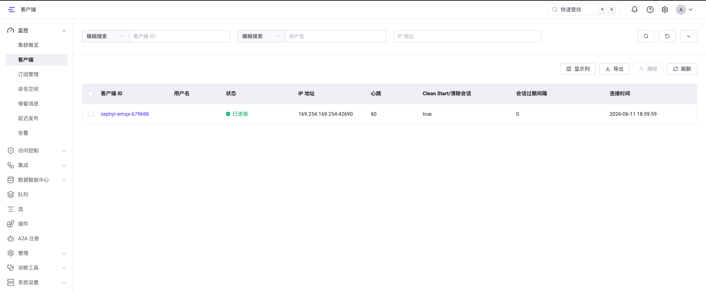

### 4.3 代码实现要点

`src/main.c` 中 `common_mqtt_connect()` 的核心流程：

1. **DNS 解析**：调用 `zsock_getaddrinfo()` 将主机名转为 IP 地址。NSOS 模式下此调用直接走宿主机 glibc 的 `getaddrinfo()`，自动享受宿主机 DNS 配置。
2. **MQTT 客户端初始化**：`mqtt_client_init(&client_ctx)` 绑定事件回调 `mqtt_evt_handler`。
3. **建立连接**：`mqtt_connect(&client_ctx)` 发起 TCP + MQTT CONNECT 报文。
4. **等待 CONNACK**：轮询 socket 文件描述符，收到 `MQTT_EVT_CONNACK` 后全局标志 `is_connected` 置为 `true`，打印 `Connection successful!`。
5. **事件分发**：子命令 `conn` 进入心跳维护循环；`sub` 调 `mqtt_subscribe` 后进入长监听；`pub` 调 `mqtt_publish` 后优雅断开。

### 4.4 消息收发演示

连接建立后，就可以体验 MQTT 最核心的发布/订阅模型。建议打开两个终端：一个运行 Zephyr shell 做订阅端，另一个使用 `mqtt_cli pub` 或 EMQX Dashboard 内置 WebSocket 客户端做发布端。

**场景一：订阅 + 接收消息**

在 Zephyr shell 中订阅主题 `test/zephyr/demo`，QoS 1：

```bash
uart:~$ mqtt_cli sub -h 100.108.113.19 -t test/zephyr/demo -q 1
```

**预期输出**：

```
Connecting to 100.108.113.19:1883 (ID: zephyr-emqx-654321, Keepalive: 60) ...
Connection successful!
Subscribing to topic: 'test/zephyr/demo' (QoS 1) ...
Entered sub listening state. Waiting for messages... (Press Ctrl+C to exit)
```

此时 Zephyr 已进入长监听。在容器内另开终端，使用`mqtt_cli pub` 向同一主题发送消息：

```bash
# 宿主机或容器内另开终端
mqtt_cli pub -h 100.108.113.19 -t test/zephyr/demo -m "Hello Zephyr" -q 1
```

Zephyr shell 侧立即打印：

```
[Received Msg] Topic: test/zephyr/demo | Payload: Hello Zephyr
```
**运行结果**：
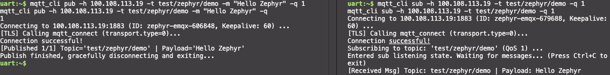

*左右分栏：右侧 Zephyr sub 侧显示收到消息的日志输出，左侧 Zephyr mqtt_cli pub 发送成功。*

**场景二：发布消息**

Zephyr 也可以作为消息生产者，发布后自动断开：

```bash
uart:~$ mqtt_cli pub -h 100.108.113.19 -t test/zephyr/demo -m "Hello from Zephyr!" -q 1
```

**预期输出**：

```
Connecting to 100.108.113.19:1883 (ID: zephyr-emqx-789012, Keepalive: 60) ...
Connection successful!
[Published 1/1] Topic='test/zephyr/demo' | Payload='Hello from Zephyr!'
Publish finished, gracefully disconnecting and exiting...
```

Zephyr shell 中 `[Published 1/1] Topic='...' | Payload='...'` 的完整输出。

**场景三：批量定时发布**

使用 `-L`（条数）和 `-I`（间隔毫秒）参数模拟设备周期性上报：

```bash
uart:~$ mqtt_cli pub -h 100.108.113.19 -t test/zephyr/demo -m "Batch msg" -q 0 -L 3 -I 500
```

**预期输出**：

```
Connection successful!
[Published 1/3] Topic='test/zephyr/demo' | Payload='Batch msg'
[Published 2/3] Topic='test/zephyr/demo' | Payload='Batch msg'
[Published 3/3] Topic='test/zephyr/demo' | Payload='Batch msg'
Publish finished, gracefully disconnecting and exiting...
```

连续三条 `[Published N/3]` 输出，时间戳间隔约 500ms。

> **验证**：以上任意操作后，打开 EMQX Dashboard（`http://localhost:18083`），在 **连接管理** 页面可看到 `zephyr-emqx-xxxxxx` 客户端，在 **主题监控** 中可看到 `test/zephyr/demo` 的消息出入站统计。

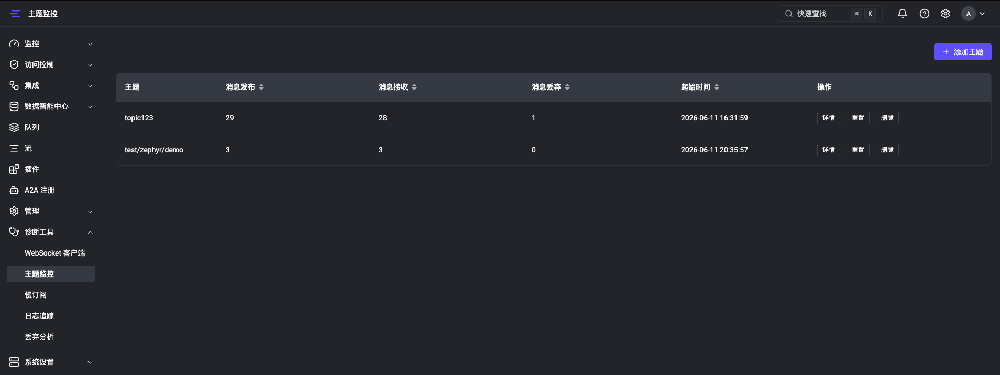

## 五、 实战演练（二）：Zephyr 客户端通过 TLS 安全连接 EMQX

本章使用 **TAP+TLS 模式**。需要 Linux 宿主机、容器 `NET_ADMIN` 权限和 `/dev/net/tun`，并需准备 TLS 证书材料。

### 5.1 安全前置：获取 SSL/TLS 证书

根据 [EMQX 官方 TLS 证书文档](https://docs.emqx.com/zh/emqx/latest/network/tls-certificate.html)，SSL/TLS 证书有三种获取途径：

1. **自签名证书**：自行创建 CA 并签发，存在安全隐患，仅建议用于测试或受控环境。
2. **申请/购买受信任 CA 签发的证书**：如 Let's Encrypt、DigiCert 等，适合生产环境。
3. **云服务商证书**：华为云、腾讯云等平台提供的托管证书。

> ⚠️ **重要提示**：本示例使用自签名证书，仅适用于开发测试或受控内网环境。生产部署请使用受信任 CA 签发的证书。

**证书生成命令参考**（与 EMQX 官方文档方法一致，使用 OpenSSL）：

```bash
# 1. 生成自签名根 CA
openssl genrsa -out rootCA.key 2048
openssl req -x509 -new -nodes -key rootCA.key -sha256 -days 3650 -out rootCA.crt

# 2. 签发服务端证书（serverAuth）
openssl genrsa -out mqtt-server.key 2048
openssl req -new -key mqtt-server.key -out mqtt-server.csr
openssl x509 -req -in mqtt-server.csr -CA rootCA.crt -CAkey rootCA.key \
    -CAcreateserial -out mqtt-server.crt -days 365 \
    -extfile server-ext.cnf

# 3. 签发客户端证书（clientAuth）—— Zephyr 侧使用
openssl genrsa -out mqtt-client.key 2048
openssl req -new -key mqtt-client.key -out mqtt-client.csr
openssl x509 -req -in mqtt-client.csr -CA rootCA.crt -CAkey rootCA.key \
    -CAcreateserial -out mqtt-client.crt -days 365 \
    -extfile client-ext.cnf
```

### 5.2 嵌入式端准备：Zephyr 凭据装载

`src/main.c` 中 TLS 凭据的装载逻辑如下：

```c
// 每次连接前，先清理上次残留的 sec_tag 凭据并释放旧缓冲
clear_registered_credential(TLS_CREDENTIAL_CA_CERTIFICATE);
clear_registered_credential(TLS_CREDENTIAL_PUBLIC_CERTIFICATE);
clear_registered_credential(TLS_CREDENTIAL_PRIVATE_KEY);

// 从文件读取证书，malloc 独立缓冲，注入 sec_tag 101
load_and_register_credential(sh, p->ca_path,   TLS_CREDENTIAL_CA_CERTIFICATE);
load_and_register_credential(sh, p->cert_path, TLS_CREDENTIAL_PUBLIC_CERTIFICATE);
load_and_register_credential(sh, p->key_path,  TLS_CREDENTIAL_PRIVATE_KEY);

// 配置 TLS 传输参数
client_ctx.transport.type = MQTT_TRANSPORT_SECURE;
client_ctx.transport.tls.config.sec_tag_list = sec_tag_list;    // {101}
client_ctx.transport.tls.config.peer_verify = p->insecure
    ? TLS_PEER_VERIFY_NONE : TLS_PEER_VERIFY_REQUIRED;
client_ctx.transport.tls.config.hostname = p->host;
```

> **注意**：每次 `mqtt_cli conn/sub/pub` 调用都会重新装载凭据到同一个 `sec_tag=101`。若不清除旧凭据，跨连接的证书残留可能导致 mTLS 握手失败（`-0x4e` / `-103`）。这也是为何 `load_and_register_credential` 内部先调用 `tls_credential_delete(101, type)` 的原因。

### 5.3 TLS 工程配置与编译

**构建命令**（在容器内执行）：

```bash
cd /workdir/mqtt-client-C-Zephyr

# TAP + TLS 模式编译（自动合并 prj.conf + prj-tap-tls.conf）
west build -d build-tap-tls -p always -b native_sim/native/64 . \
    -- -DOVERLAY_CONFIG=prj-tap-tls.conf
```

**编译输出**：
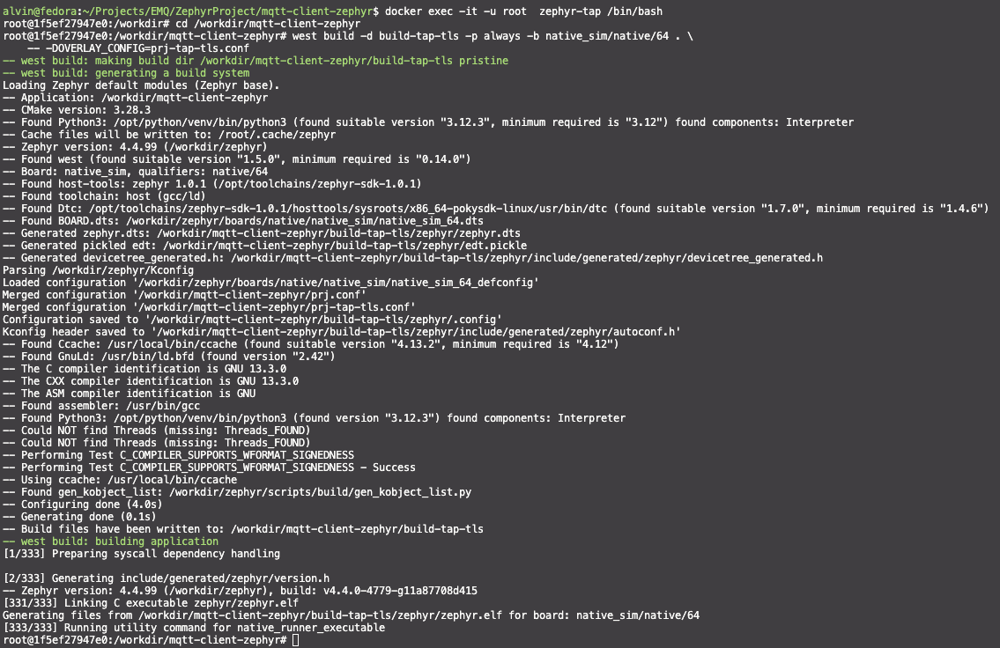

*`west build` 成功输出末尾：`[333/333] Running utility command for native_runner_executable`。*

`prj-tap-tls.conf` 中与 TLS 直接相关的 Kconfig 项：

```ini
# MQTT TLS 传输层
CONFIG_MQTT_LIB_TLS=y
CONFIG_NET_SOCKETS_SOCKOPT_TLS=y

# mbedTLS 栈配置
CONFIG_MBEDTLS=y
CONFIG_MBEDTLS_ENABLE_HEAP=y
CONFIG_MBEDTLS_HEAP_SIZE=30000
CONFIG_MBEDTLS_SSL_IN_CONTENT_LEN=2048
CONFIG_MBEDTLS_SSL_OUT_CONTENT_LEN=2048

# 密码套件：ECDHE-RSA 密钥交换 + AES-128-GCM 加密（已验证与 EMQX 兼容）
CONFIG_MBEDTLS_CIPHERSUITE_TLS_ECDHE_RSA_WITH_AES_128_GCM_SHA256=y

# PEM 证书格式支持
CONFIG_MBEDTLS_PEM_PARSE_C=y
CONFIG_MBEDTLS_PEM_WRITE_C=y

# PSA 密钥类型（TLS 握手必需）
CONFIG_PSA_WANT_KEY_TYPE_RSA_PUBLIC_KEY=y
CONFIG_PSA_WANT_KEY_TYPE_ECC_PUBLIC_KEY=y

# TAP 网络配置
CONFIG_NET_CONFIG_SETTINGS=y
CONFIG_NET_CONFIG_MY_IPV4_ADDR="192.0.2.1"
CONFIG_NET_CONFIG_MY_IPV4_GW="192.0.2.2"
CONFIG_NET_CONFIG_PEER_IPV4_ADDR="192.0.2.2"
```

### 5.4 启动与 TLS 连接验证

```bash
# 使用 sudo 以配置 iptables/zeth
sudo ./run-zephyr-tap.sh
```

脚本会自动完成：启动 Zephyr → 等待 `zeth` 虚拟网卡 → 分配 IP `192.0.2.2/24` → 开启 IP 转发 → 添加 iptables NAT/FORWARD 规则 → 前台交互。

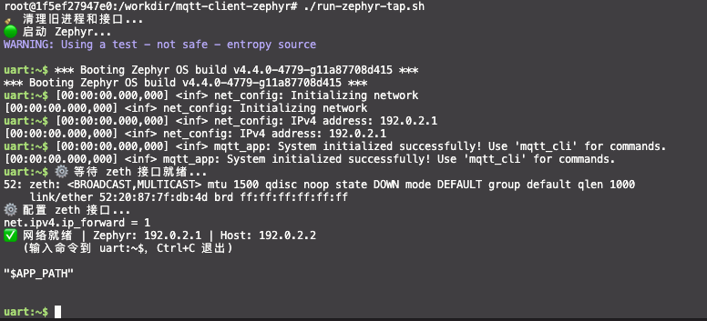

*`run-zephyr-tap.sh` 启动后的网络就绪提示：`✅ 网络就绪 | Zephyr: 192.0.2.1 | Host: 192.0.2.2`。*

**TLS 连接测试**（以本地 EMQX 的 TLS 监听器为例）：

```bash
uart:~$ mqtt_cli conn -h 100.108.113.19 -p 8084 \
    --ca certs/self_certs/rootCA.crt \
    --cert certs/self_certs/mqtt-client.crt \
    --key certs/self_certs/mqtt-client.key \
    --insecure
```

**预期输出**：

```
[TLS] CA certificate loaded OK (tag 101)
[TLS] Config: peer_verify=0, sec_tag_count=1, hostname=100.108.113.19
Connecting to 100.108.113.19:8084 (ID: zephyr-emqx-345678, Keepalive: 60) ...
[TLS] Calling mqtt_connect (transport.type=1)...
Connection successful!
Entered conn blocking maintenance mode. Press Ctrl+C to terminate simulation process.
```

**运行结果**：
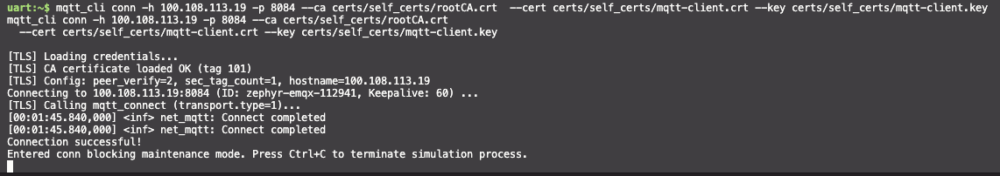

*Zephyr shell 中完整 TLS 连接日志，包含 `CA certificate loaded OK`、`peer_verify`、`hostname`、`Connection successful!`。*

### 5.5 TLS 加密消息收发演示

与 TCP 模式类似，Zephyr TLS 客户端同样支持订阅和发布。演示使用本地 EMQX TLS 监听器（`100.108.113.19:8084`）。

**场景一：TLS 订阅 + 接收加密消息**

```bash
uart:~$ mqtt_cli sub -h 100.108.113.19 -p 8084 \
    --ca certs/self_certs/rootCA.crt \
    --cert certs/self_certs/mqtt-client.crt \
    --key certs/self_certs/mqtt-client.key \
    --insecure \
    -t test/tls/demo -q 1
```

**预期输出**：

```
[TLS] CA certificate loaded OK (tag 101)
Connecting to 100.108.113.19:8084 (ID: zephyr-emqx-... ) ...
Connection successful!
Subscribing to topic: 'test/tls/demo' (QoS 1) ...
Entered sub listening state. Waiting for messages... (Press Ctrl+C to exit)
```

在宿主机使用 `mqtt_cli` 向同一 TLS 端口发送消息（需带客户端证书）：

```bash
mqtt_cli pub -h 100.108.113.19 -p 8084 \
    --ca certs/self_certs/rootCA.crt \
    --cert certs/self_certs/mqtt-client.crt \
    --key certs/self_certs/mqtt-client.key \
    -t test/tls/demo -m "Hello via TLS!" -q 1
```

Zephyr shell 侧收到：

```
[Received Msg] Topic: test/tls/demo | Payload: Hello via TLS!
```

**场景二：TLS 加密发布**

```bash
uart:~$ mqtt_cli pub -h 100.108.113.19 -p 8084 \
    --ca certs/self_certs/rootCA.crt \
    --cert certs/self_certs/mqtt-client.crt \
    --key certs/self_certs/mqtt-client.key \
    -t test/tls/demo -m "Hello from Zephyr via TLS!" -q 1
```

**预期输出**：

```
[TLS] CA certificate loaded OK (tag 101)
Connection successful!
[Published 1/1] Topic='test/tls/demo' | Payload='Hello from Zephyr via TLS!'
Publish finished, gracefully disconnecting and exiting...
```
**运行结果**：
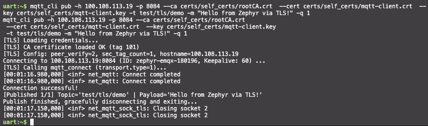

*Zephyr TLS pub 侧的 `[Published 1/1]` 输出。*


## 六、 工程配置与运行环境配置对比

### 6.1 双模式完整对比表

| 维度 | NSOS / TCP-only | TAP + TLS |
|------|-----------------|-----------|
| **网络模型** | native_sim offloaded sockets，复用宿主机网络栈 | Zephyr 独立网络栈，虚拟网卡 `zeth` |
| **Overlay 配置** | `prj-nsos.conf`（3 行） | `prj-tap-tls.conf`（~35 行） |
| **构建目录** | `build-nsos` | `build-tap-tls` |
| **启动脚本** | `./run-zephyr-nsos.sh`（无需 sudo） | `sudo ./run-zephyr-tap.sh` |
| **TLS 支持** | ❌ 不支持（offloaded socket 无 `SO_TLS`） | ✅ TLS 1.2 + mTLS |
| **证书需求** | 无 | root CA + client cert + client key |
| **TUN/TAP 依赖** | 不需要 | `/dev/net/tun` + `NET_ADMIN` |
| **宿主机要求** | 任意（含 macOS Docker Desktop） | Linux 宿主机或 WSL2 |
| **连接命令示例** | `mqtt_cli conn -h 100.108.113.19` | `mqtt_cli conn -h 100.108.113.19 -p 8084 --ca ... --cert ... --key ... <--insecure>` |
| **订阅命令示例** | `mqtt_cli sub -t test/demo` | `mqtt_cli sub --ca ... --cert ... --key ... <--insecure> -t test/demo` |
| **发布命令示例** | `mqtt_cli pub -t test/demo -m "Hi"` | `mqtt_cli pub --ca ... --cert ... --key ... <--insecure> -t test/demo -m "Hi"` |
| **适用场景** | 快速验证、内网非加密设备、CI 自动化 | 安全评估、TLS/mTLS 可行性验证、证书集成测试 |
| **限制** | 不适用于需要加密或证书身份认证的场景 | 部署复杂度较高，不支持 macOS Docker Desktop |

### 6.2 构建命令对照

```bash
# NSOS / TCP-only
west build -d build-nsos -p always -b native_sim/native/64 . \
    -- -DOVERLAY_CONFIG=prj-nsos.conf

# TAP + TLS
west build -d build-tap-tls -p always -b native_sim/native/64 . \
    -- -DOVERLAY_CONFIG=prj-tap-tls.conf
```

两者均以 `prj.conf` 为共享基础，仅 overlay 文件不同，Zephyr 构建系统会自动合并 Kconfig 项。


## 七、 常见问题与排障指南

### Q1：NSOS 模式下使用 `--ca` 等 TLS 参数时报错？
**原因**：NSOS 模式未启用 `CONFIG_MQTT_LIB_TLS`，TLS 代码段被 `#ifdef` 排除。**解决**：切换到 TAP+TLS 模式，或仅使用明文 MQTT。

### Q2：TAP 模式下 `run-zephyr-tap.sh` 报 "zeth 接口超时"？
**原因**：容器缺少 `NET_ADMIN` 权限或 `/dev/net/tun` 设备。**解决**：启动容器时添加 `--cap-add=NET_ADMIN --device=/dev/net/tun`，并确认 `lsmod | grep tun` 有输出。

### Q3：TLS 连接报 `-0x4e` 或 `Underlying connection failed: -103`？
**原因**：`-0x4e` 即 `MBEDTLS_ERR_NET_SEND_FAILED`，通常由证书角色混用（把 server cert 当 client cert）、sec_tag 凭据残留或 broker 端证书配置不匹配引起。**解决**：确认客户端使用 `clientAuth` EKU 的证书；确认 broker 端是否开启客户端证书校验；确保每次连接前清理旧 TLS 凭据（本项目已内置此逻辑）。

### Q4：macOS Docker Desktop 上 TAP 模式不可用？
**原因**：macOS Docker Desktop 的 LinuxKit 虚拟机不支持 TAP 设备的完整 TCP 转发。**解决**：使用 NSOS/TCP-only 模式，或切换到 Linux 宿主机/WSL2。

### Q5：自签名证书能否用于生产？
**不能**。自签名证书仅用于开发测试或受控内网环境。生产环境请使用受信任 CA（如 Let's Encrypt、DigiCert）签发的证书，并移除 `--insecure` 启用完整证书链验证。


## 八、 总结与展望

本文从零开始，演示了如何在 Zephyr RTOS 上构建 MQTT 客户端，并分两种模式连接到 EMQX Broker：

1. **NSOS/TCP-only 模式**：三步即可运行——`west build` → `./run-zephyr-nsos.sh` → `mqtt_cli conn`。适合快速验证 MQTT 发布/订阅的完整流程，无需任何额外权限或证书。
2. **TAP+TLS 模式**：在 Zephyr 独立网络栈上启用 TLS 1.2 加密和 mTLS 双向认证，通过 `zeth` 虚拟网卡和 iptables NAT 实现外网访问，满足嵌入式设备安全通信的评估需求。

通过 `mqtt_cli sub` 和 `mqtt_cli pub` 命令，您可以方便地在 Zephyr shell 中完成消息的发布与订阅验证，结合 EMQX Dashboard 实时观察设备连接状态和消息流量。

**后续扩展方向**：

- 集成 EMQX 规则引擎，将 Zephyr 端侧数据实时桥接到 Kafka/PostgreSQL/TimescaleDB
- 基于 MQTT 5.0 的请求-响应模式实现设备命令下发
- 使用 EMQX 文件传输功能实现 Zephyr 端 OTA 固件升级
- 在真实硬件（如 nRF52840、ESP32）上部署并测试功耗与稳定性