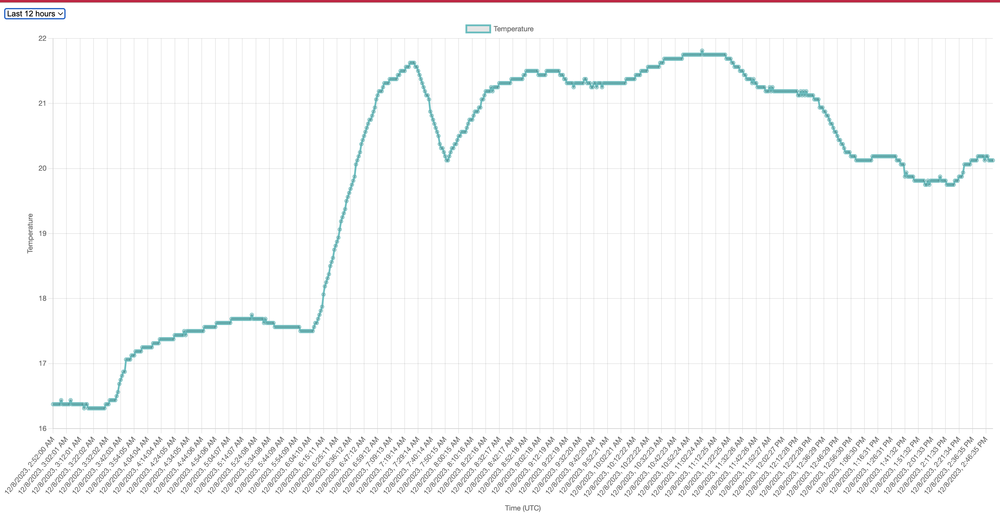
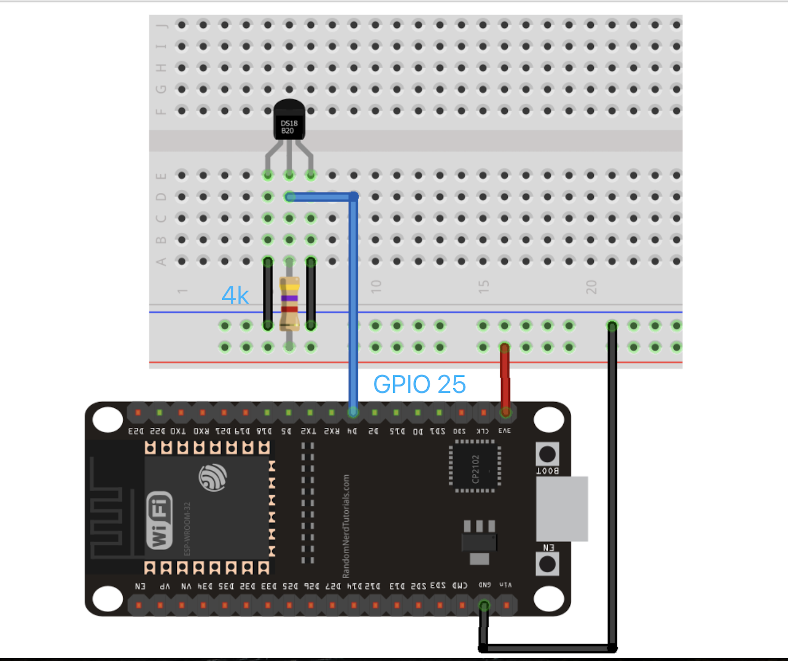

# ESP32 Temperature Monitoring and Web Application Project

This project consists of two main parts: an ESP32 device sending temperature data using MQTT and a Flask-based web application that displays this data.



## Part 1: ESP32 Temperature Monitoring

### Requirements

- ESP32 Development Board
- DS18B20 Temperature Sensor
- Arduino IDE with ESP32 support
- Wi-Fi connection

### Configuration and Setup

1. **Install the Arduino IDE**:
   Download and install from [Arduino website](https://www.arduino.cc/en/software).

2. **Add ESP32 Support in Arduino IDE**:
   Follow the instructions [here](https://randomnerdtutorials.com/installing-the-esp32-board-in-arduino-ide-windows-instructions/).

3. **Install Required Libraries**:
   In Arduino IDE, go to `Sketch` > `Include Library` > `Manage Libraries...` and install:
    - `WiFi`
    - `PubSubClient`
    - `ArduinoJson`
    - `OneWire`
    - `DallasTemperature`

4. **Configure Wi-Fi and MQTT Settings**:
   Modify the provided ESP32 code in Arduino IDE with your Wi-Fi and MQTT details.

5. **Connect the DS18B20 Sensor to ESP32**:
    - DS18B20 VCC to ESP32 3.3V
    - DS18B20 GND to ESP32 GND
    - DS18B20 Data to ESP32 GPIO 25
      

6. **Upload the Code**:
   Connect ESP32 to your computer, select the correct board and port in Arduino IDE, and upload.

## Part 2: Flask Web Application

### Requirements

- Python 3.8 or later
- Virtual environment tool (e.g., `virtualenv`)

### Local Setup

1. **Clone the Repository**:
   ```
   git clone [Repository URL]
   cd [Repository Name]
   ```

2. **Create a Virtual Environment**:
   ```
   python -m venv venv
   source venv/bin/activate  # Windows: venv\Scripts\activate
   ```

3. **Install Dependencies**:
   ```
   pip install -r requirements.txt
   ```

4. **Configure MQTT Settings in `app.py`**:
   Modify MQTT configuration in `app.py`.

5. **Run the Application**:
   ```
   python app.py
   ```
   Access at `http://localhost:8080`.

### Deploying to Fly.io

1. **Install Fly.io CLI**:
   Follow instructions on [Fly.io documentation](https://fly.io/docs/getting-started/installing-flyctl/).

2. **Login to Fly.io**:
   ```
   flyctl auth login
   ```

3. **Initialize Fly.io App**:
   ```
   flyctl launch
   ```

4. **Deploy the App**:
   ```
   flyctl deploy
   ```

5. **Verify Deployment**:
   ```
   flyctl status
   ```
