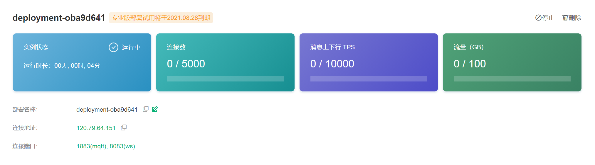
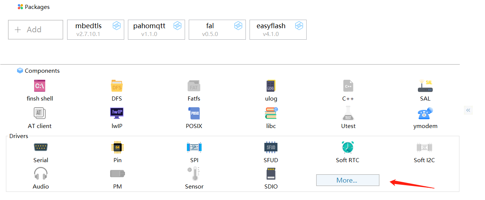
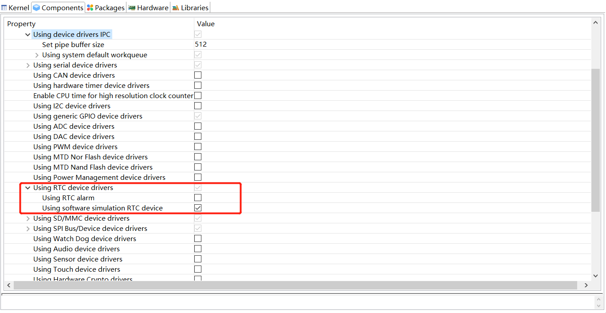
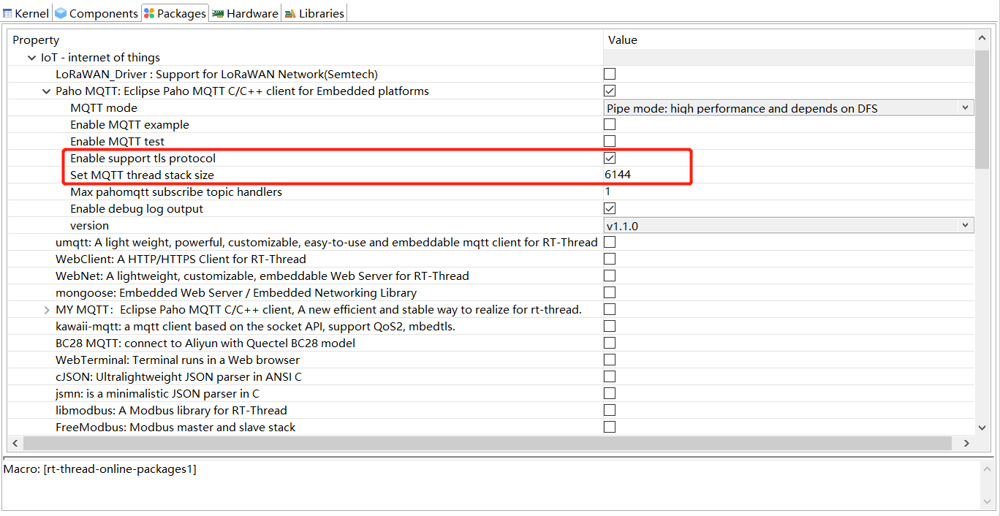
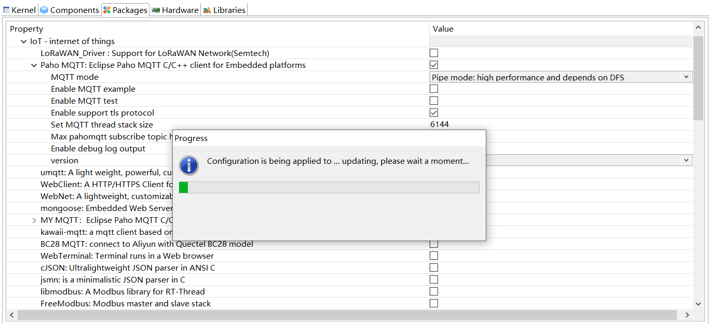
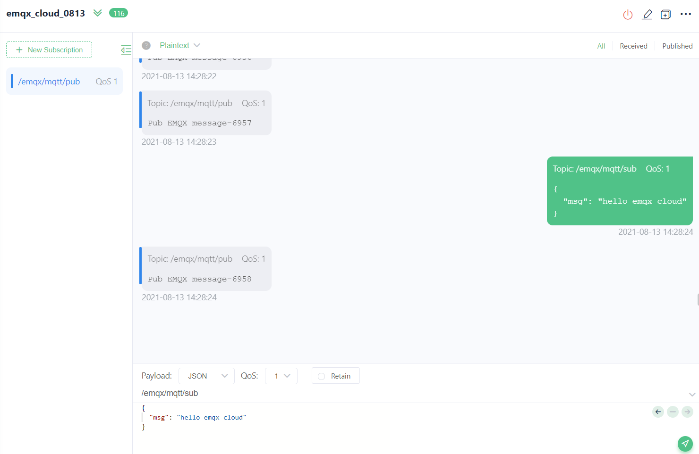

# RT-Thread 连接 EMQ X Cloud with TLS/SSL

本文将使用[RT-Thread](https://www.rt-thread.org/)配合[ART-Pi](https://github.com/RT-Thread-Studio/sdk-bsp-stm32h750-realthread-artpi)搭建MQTT客户端，快速接入[EMQ X Cloud](https://www.emqx.com/zh/cloud) 。


## EMQ X Cloud简介

[EMQ X Cloud](https://www.emqx.com/zh/cloud) 是由 [EMQ](https://www.emqx.com/zh) 公司推出的可连接海量物联网设备，集成各类数据库及业务系统的全托管云原生 MQTT 服务。作为**全球首个全托管的** [**MQTT 5.0**](https://links.jianshu.com/go?to=https%3A%2F%2Fwww.emqx.com%2Fzh%2Fmqtt%2Fmqtt5) **公有云服务**，EMQ X Cloud 提供了一站式运维代管、独有隔离环境的 MQTT 消息服务。

在万物互联的时代，EMQ X Cloud 可以帮助用户快速构建面向物联网领域的行业应用，轻松实现物联网数据的采集、传输、计算和持久化。

借助云服务商提供的基础计算设施，EMQ X Cloud 面向全球数十个国家与地区提供服务，为 5G 与万物互联应用提供低成本、安全可靠的云服务。

## 创建和部署EMQ X Cloud

通过[**快速入门**](https://docs.emqx.cn/cloud/latest/quick_start/introduction.html)创建部署[EMQX Cloud](https://docs.emqx.cn/cloud/latest/)

以下是创建完成的实例

- 基础版


- 专业版



- **TLS/SSL** 配置可参考 https://docs.emqx.cn/cloud/latest/deployments/tls_ssl.html

## 创建项目工程

本文使用[RT-Thread](https://www.rt-thread.org/)官方IDE [RT-Thread-Studio](https://www.rt-thread.org/page/studio.html)来创建工程；

> 本次Demo使用的是RT-Thread官方的开发板 ART-Pi，通过板载Wifi模块进行联网，可以直接创建一个art_pi_wifi样例工程进行MQTT客户端的开发；


## 工程配置和引入依赖包

1. 进入配置页面<br><br>选择“More”<br>

2. 启用RTC驱动<br>

3. 引入MQTT依赖包<br>启动TLS需设置mqtt线程栈大小 ≥ 6144

4. 配置mbedtls

   1. 若选择**用户CA**证书(单/双向认证)<br>

      

   2. 若选择无证书SSL连接(单向认证)<br>

5. 保存当前配置，IDE会将配置更新到工程中<br>

6. 修改宏 **MEMP_NUM_NETDB** 为 **2** <br>位于项目路径"rt-thread\components\net\lwip-2.0.2\src\include\lwip\opt.h:488"<br>

   ```c
   /**
    * MEMP_NUM_NETDB: the number of concurrently running lwip_addrinfo() calls
    * (before freeing the corresponding memory using lwip_freeaddrinfo()).
    */
   #if !defined MEMP_NUM_NETDB || defined __DOXYGEN__
   #define MEMP_NUM_NETDB                  2
   #endif
   ```


## 代码编写

1. 打开**applications/main.c**,可见RT-Thread-Studio已经帮我们生成好了连接WiFi和LED操作的代码<br>

   ```c
   #include <rtthread.h>
   #include <rtdevice.h>
   #include "drv_common.h"
   
   #define LED_PIN GET_PIN(I, 8)
   
   extern void wlan_autoconnect_init(void);
   
   int main(void)
   {
       rt_uint32_t count = 1;
       rt_pin_mode(LED_PIN, PIN_MODE_OUTPUT);
   
       /* init Wi-Fi auto connect feature */
       wlan_autoconnect_init();
       /* enable auto reconnect on WLAN device */
       rt_wlan_config_autoreconnect(RT_TRUE);
   
       while(count++)
       {
           rt_thread_mdelay(500);
           rt_pin_write(LED_PIN, PIN_HIGH);
           rt_thread_mdelay(500);
           rt_pin_write(LED_PIN, PIN_LOW);
       }
       return RT_EOK;
   }
   
   #include "stm32h7xx.h"
   static int vtor_config(void)
   {
       /* Vector Table Relocation in Internal QSPI_FLASH */
       SCB->VTOR = QSPI_BASE;
       return 0;
   }
   INIT_BOARD_EXPORT(vtor_config);
   ```

2. 为了实现第一次启动也能自动连接WiFi，我们可以在main()加入连接函数；<br>

   ```c
    rt_wlan_connect(WIFI_SSID, WIFI_PASSWORD);
   ```

3. 分别新建mqtt-client.c和mqtt-client.h;<br>创建mqtt client<br>

   ```c
   static void mqtt_create(void)
   {
       /* init condata param by using MQTTPacket_connectData_initializer */
       MQTTPacket_connectData condata = MQTTPacket_connectData_initializer;
   
       static char client_id[50] = { 0 };
   
       rt_memset(&client, 0, sizeof(MQTTClient));
   
       /* config MQTT context param */
       {
           client.uri = MQTT_BROKER_URI;
   
           /* config connect param */
           memcpy(&client.condata, &condata, sizeof(condata));
           rt_snprintf(client_id, sizeof(client_id), "%s%d",MQTT_CLIENTID, rt_tick_get());
           client.condata.clientID.cstring = client_id;
           client.condata.keepAliveInterval = 60;
           client.condata.cleansession = 1;
           client.condata.username.cstring = MQTT_USERNAME;
           client.condata.password.cstring = MQTT_PASSWORD;
   
           /* config MQTT will param. */
           client.condata.willFlag = 1;
           client.condata.will.qos = MQTT_QOS;
           client.condata.will.retained = 0;
           client.condata.will.topicName.cstring = MQTT_PUBTOPIC;
           client.condata.will.message.cstring = MQTT_WILLMSG;
   
           /* malloc buffer. */
           client.buf_size = client.readbuf_size = MQTT_PUB_SUB_BUF_SIZE;
           client.buf = rt_malloc(client.buf_size);
           client.readbuf = rt_malloc(client.readbuf_size);
           if (!(client.buf && client.readbuf))
           {
               rt_kprintf("no memory for MQTT client buffer!\n");
               goto _exit;
           }
   
           /* set event callback function */
           client.connect_callback = mqtt_connect_callback;
           client.online_callback = mqtt_online_callback;
           client.offline_callback = mqtt_offline_callback;
   
           /* set subscribe table and event callback */
           client.messageHandlers[0].topicFilter = rt_strdup(MQTT_SUBTOPIC);
           client.messageHandlers[0].callback = mqtt_sub_callback;
           client.messageHandlers[0].qos = MQTT_QOS;
   
           /* set default subscribe event callback */
           client.defaultMessageHandler = mqtt_sub_callback;
       }
   
       /* run mqtt client */
       paho_mqtt_start(&client);
   
       return;
   
   _exit:
       if (client.buf)
       {
           rt_free(client.buf);
           client.buf = RT_NULL;
       }
       if (client.readbuf)
       {
           rt_free(client.readbuf);
           client.readbuf = RT_NULL;
       }
       return;
   }
   ```

   对应 **连接**/**订阅**/**上线**/**离线** 回调函数<br>

   ```c
   static void mqtt_connect_callback(MQTTClient *c)
   {
       LOG_D("mqtt_connect_callback!");
   }
   
   static void mqtt_sub_callback(MQTTClient *c, MessageData *msg_data)
   {
       sub_count++;
       *((char *)msg_data->message->payload + msg_data->message->payloadlen) = '\0';
       rt_kprintf("mqtt sub callback[%u]: \n topic: %.*s \n message %.*s",
                  sub_count,
                  msg_data->topicName->lenstring.len,
                  msg_data->topicName->lenstring.data,
                  msg_data->message->payloadlen,
                  (char *)msg_data->message->payload);
   }
   
   static void mqtt_online_callback(MQTTClient *c)
   {
       LOG_D("mqtt_online_callback!");
   }
   
   static void mqtt_offline_callback(MQTTClient *c)
   {
       LOG_D("mqtt_offline_callback!");
   }
   ```

   创建pub线程回调函数和mqtt客户端启动函数<br>

   ```c
   static void thread_pub(void *parameter)
   {
       pub_data = rt_malloc(TEST_DATA_SIZE * sizeof(char));
       if (!pub_data)
       {
           rt_kprintf("no memory for pub_data\n");
           return;
       }
   
       start_tm = time((time_t *) RT_NULL);
       rt_kprintf("test start at '%d'\r\n", start_tm);
   
       while (1)
       {
           rt_snprintf(pub_data, TEST_DATA_SIZE, "Pub EMQX message-%d", pub_count);
   
           if (!paho_mqtt_publish(&client, QOS1, MQTT_PUBTOPIC, pub_data))
           {
               ++pub_count;
           }
   
           rt_thread_delay(PUB_CYCLE_TM);
       }
   }
   
   void mqtt_client_start(void)
   {
       if (is_started)
       {
           return;
       }
   
       mqtt_create();
   
       while (!client.isconnected)
       {
           rt_kprintf("Waiting for mqtt connection...\n");
           rt_thread_delay(1000);
       }
   
       pub_thread_tid = rt_thread_create("pub_thread", thread_pub, RT_NULL, 1024, 8, 100);
       if (pub_thread_tid != RT_NULL)
       {
           rt_thread_startup(pub_thread_tid);
       }
   
       is_started = 1;
   
       return;
   }
   ```

   设置mqtt连接参数和用户名<br>

   ```c
   #define EMQX_Cloud_Professional_Version 1
   #define EMQX_Cloud_TLS_SSL 1
   
   #if !EMQX_Cloud_Professional_Version
   
   #if EMQX_Cloud_TLS_SSL
   #define MQTT_BROKER_URI         "ssl://ge06f1e1.cn-shenzhen.emqx.cloud:15455"
   #else
   #define MQTT_BROKER_URI         "tcp://ge06f1e1.cn-shenzhen.emqx.cloud:15915"
   #endif
   #else
   
   #if EMQX_Cloud_TLS_SSL
   #define MQTT_BROKER_URI         "ssl://oba9d641.emqx.cloud:8883"
   #else
   #define MQTT_BROKER_URI         "tcp://oba9d641.emqx.cloud:1883"
   #endif
   
   #endif
   
   #define MQTT_CLIENTID_PREFIX    "rtthread-mqtt"
   #define MQTT_USERNAME           "EMQX_RTT"
   #define MQTT_PASSWORD           "emqx_rtt_0813"
   #define MQTT_SUBTOPIC           "/emqx/mqtt/sub"
   #define MQTT_PUBTOPIC           "/emqx/mqtt/pub"
   #define MQTT_WILLMSG            "Goodbye!"
   #define MQTT_QOS                1
   ```

   main()函数启动mqtt client<br>

   ```c
   mqtt_client_start()
   ```
   
   也可在终端手动启动/停止<br>
   
   ```shell
   mqtt_ctrl start
   mqtt_ctrl stop
   ```
   
   若选择用户CA证书验证，则将CA证书(双向认证还需client.crt和client.key)放置到**packages/mbedtls-latest/certs**文件夹中<br>
   
   重新更新工程，会自动将证书内容复制到源文件中<br>
   
   构建项目并下载到目标板上
   
   打开终端Terminal可以看到运行日志<br>
   
   

## 使用[MQTTX](https://mqttx.app/zh)测试数据收发

客户端连接配置<br>单向无证书认证<br>

单向自签名证书认证<br>

双向认证<br>

订阅和发布<br>


​	查看RT-Thread-Stdio终端<br>

**数据收发正常！**


## 完整代码

请见 [MQTT-Client-Examples](https://github.com/emqx/MQTT-Client-Examples)


