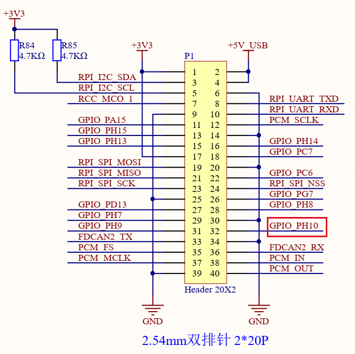
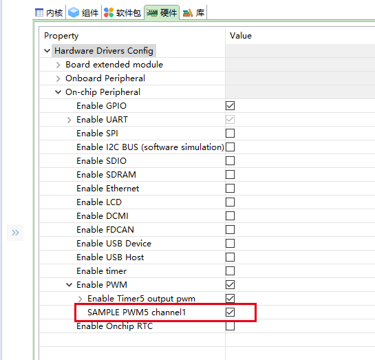
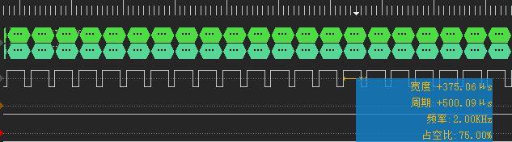

# PWM 测试例程

## 简介

本例程是用来测试 **PWM** 功能的一个测试程序。

## 硬件说明

本例程使用 **PH.10** 作为 PWM 输出引脚。

## 配置说明

在确保已经按照 [STM32外设驱动添加指南](https://github.com/RT-Thread/rt-thread/tree/master/bsp/stm32/docs) 之后，在 RT-Thread Studio 中开启

## 软件说明

勾选 **SAMPLE PWM5 channel1** ,重新编译烧录程序之后，会导出 `pwm_sample` 命令。
因为 PH.10 未连接其他外设，所以这里可以使用逻辑分析仪来查看 PWM 的运行效果。

