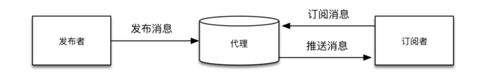

# MQTT 工作原理

## MQTT 协议工作原理
在 MQTT 协议中有三种身份：发布者（Publish）、代理（Broker）（服务器）和订阅者（Subscribe）。其中消息的发布者和订阅者都是客户端，消息代理是服务器，消息发布者可以同时是订阅者，这三者的关系如下图所示：

 

在 MQTT 协议的实际使用过程中，一般遵循以下流程：

- 发布者通过代理服务器向指定的 Topic 发布消息。
- 订阅者通过代理服务器订阅所需要的 Topic。
- 订阅成功后如果有发布者向订阅者订阅的 Topic 发布消息，那么订阅者就会收到代理服务器的推送消息，通过这种方式可以进行高效的数据交换。

