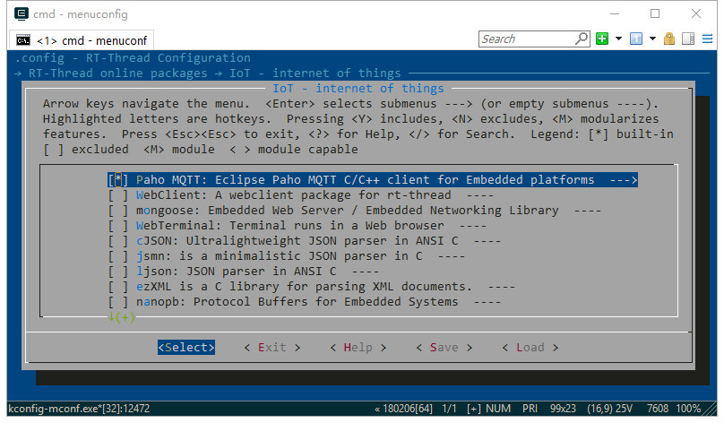
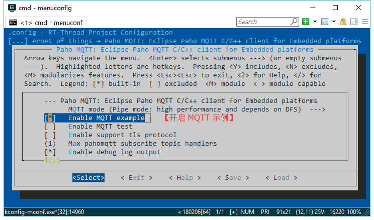

# MQTT 使用说明

## 准备工作

首先需要下载 MQTT 软件包，并将软件包加入到项目中。在 BSP 目录下使用 menuconfig 命令打开 Env 配置界面，在 `RT-Thread online packages → IoT - internet of things`  中选择 Paho MQTT 软件包，操作界面如下图所示：



开启功能示例，便于测试 MQTT 功能：



配置项介绍如下：

```c
--- Paho MQTT: Eclipse Paho MQTT C/C++ client for Embedded platforms  
    MQTT mode (Pipe mode: high performance and depends on DFS)  --->#高级功能
    [*]   Enable MQTT example              #开启 MQTT 功能示例     
    [ ]   Enable MQTT test                 #开启 MQTT 测试例程    
    [ ]   Enable support tls protocol      #开启 TLS 安全传输选项      
    (1)   Max pahomqtt subscribe topic handlers  #设置 Topic 最大订阅数量 
    [*]   Enable debug log output          #开启调试Log输出                 
    version (latest)  --->                 #选择软件包版本，默认为最新版
```
选择合适的配置项后，使用 `pkgs --update` 命令下载软件包并添加到工程中即可。

## 使用流程

这一节介绍 MQTT 软件包的配置参数和使用方法。

### 设置代理信息

首先要设置好代理服务器的地址，用户名、密码等必要信息。以 MQTT sample 为例有如下的设置：

```c
#define MQTT_URI                "tcp://iot.eclipse.org:1883"   //设置服务器地址
#define MQTT_USERNAME           "admin"                        //代理服务器用户名
#define MQTT_PASSWORD           "admin"                        //代理服务器密码
#define MQTT_SUBTOPIC           "/mqtt/test"                   //订阅的 Topic
#define MQTT_PUBTOPIC           "/mqtt/test"                   //推送的 Topic
#define MQTT_WILLMSG            "Goodbye!"                     //设置断开通知消息
```

### 配置 MQTT 客户端结构体

接下来需要初始化 MQTT 软件包客户端实例，将上一步设定的数据写入客户端实例的配置项，对客户端进行必要的配置，在这一步需要进行如下操作：

- 设置服务器地址，以及服务器账号密码等信息，示例代码如下：

``` c
/* 配置连接参数 */
memcpy(&client.condata, &condata, sizeof(condata));
client.condata.clientID.cstring = cid;
client.condata.keepAliveInterval = 60;
client.condata.cleansession = 1;
client.condata.username.cstring = MQTT_USERNAME;            //设置账号
client.condata.password.cstring = MQTT_PASSWORD;            //设置密码
```

- 设置消息等级、推送 Topic、以及断开通知消息等配置，示例如下：

``` c
/* 配置断开通知消息 */
client.condata.willFlag = 1;
client.condata.will.qos = 1;
client.condata.will.retained = 0;
client.condata.will.topicName.cstring = rt_strdup(MQTT_PUBTOPIC);     //设置推送主题,需要分配空间存储 topic，以便后面订阅多个 topic
client.condata.will.message.cstring = MQTT_WILLMSG;        //设置断开通知消息
```

- 设置事件回调函数，这里需要为事件设置回掉函数，如连接成功事件、上线成功事件、下线事件等，示例代码如下：

``` c
/* 设置事件回调函数，回调函数需要自己编写，在例程中为回调函数留了空函数 */
client.connect_callback = mqtt_connect_callback;       //设置连接回调函数
client.online_callback = mqtt_online_callback;         //设置上线回调函数
client.offline_callback = mqtt_offline_callback;       //设置下线回调函数
```

- 设置客户端订阅表，MQTT 客户端可以同时订阅多个 Topic， 所以需要维护一个订阅表，在这一步需要为每一个 Topic 的订阅设置参数，主要包括 Topic 名称、该订阅的回调函数以及消息等级，代码示例如下：

``` c
/* 配置订阅表 */
client.messageHandlers[0].topicFilter = MQTT_SUBTOPIC; //设置第一个订阅的 Topic
client.messageHandlers[0].callback = mqtt_sub_callback;//设置该订阅的回调函数
client.messageHandlers[0].qos = QOS1;                  //设置该订阅的消息等级
/* set default subscribe event callback */
client.defaultMessageHandler = mqtt_sub_default_callback; //设置一个默认的回调函数，如果有订阅的 Topic 没有设置回调函数，则使用该默认回调函数
```

### 启动 MQTT 客户端

配置完成 MQTT 客户端实例后，需要启动客户端，代码示例如下：

``` c
/* 运行 MQTT 客户端 */
paho_mqtt_start(&client);
```

启动 MQTT 客户端之后，客户端会自动连接代理服务器，自动订阅已经设置的 Topic，根据事件执行回调函数进行数据的处理。

### 向指定 Topic 推送消息

连接服务器成功之后，便可以通过代理服务器向指定的 Topic 推送消息。推送消息时需要设置消息内容、Topic、消息等级等配置，使用接口如下：

``` c
// 向指定 Topic 发送消息信息
int paho_mqtt_publish(MQTTClient *client, enum QoS qos, const char *topic, const char *msg_str);
```

## 运行效果

演示示例可以展示连接服务器、订阅 Topic、向指定 Topic 推送消息的功能，如下所示：

``` c
msh />mqtt_start                             /* 启动 MQTT 客户端连接代理服务器 */
inter mqtt_connect_callback!                 /* 连接成功，运行上线回调函数 */
ipv4 address port: 1883
[MQTT] HOST =  'iot.eclipse.org'
msh />[MQTT] Subscribe 
inter mqtt_online_callback!                 /* 上线成功，运行在线回调函数 */
msh />mqtt_publish hello-rtthread           /* 向指定 Topic 推送消息 */
msh />mqtt sub callback: /mqtt/test hello-rtthread     /* 收到消息，执行回调函数 */
```

!!! note "注意事项"
      需要注意正确填写 `MQTT_USERNAME` 和 `MQTT_PASSWORD` ，如果 `MQTT_USERNAME` 和 `MQTT_PASSWORD` 填写错误，MQTT 客户端无法正确连接到 MQTT 服务器。

## 参考资料

- [MQTT 官网](http://mqtt.org/)
- [Paho 官网](http://www.eclipse.org/paho/downloads.php)
- [IBM MQTT 介绍](https://www.ibm.com/developerworks/cn/iot/iot-mqtt-why-good-for-iot/index.html)
- [Eclipse paho.mqtt 源码](https://github.com/eclipse/paho.mqtt.embedded-c)
